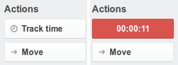
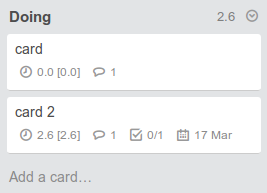
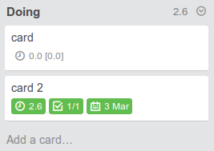

# Trello Timer

Firefox extension to track time for trello cards.

## Adds a new card action button
Allows interactive time tracking, due date icon is replaced with a calendar 
one.  

## Stores data in a local database
Time is logged in a local database (indexedDB), log entries are added through
comments, so it is possible to log time manually by adding a comment
 
``log `hh:mm:ss` ``

## Displays card stats on the board
Each card has an additional badge showing "today [total]" time spent on the
card. The list heading displays time spent today on the whole list.

## Available options 

### Position of time icon on the card
You can position the timer badge at the front or the end of the badge node.  
Default is front (left side).

### Enable completed cards
Changes display options for completed cards. Completed card is a card that has
a completed checklist and a due date in the past. If these conditions are met,
the timer badge will only show the total time spent and both timer badge and
due date badge will get a green background.  
If the given lists contains completed cards only, the list header will display
the total time spent.  
Default is false

### Hide description icon
Hides description icon in the list view.  
Default is false

### Hide comment icon
Hides comments icon in the list view.  
Default is false

## Installation

At the moment you can install it only manually by first building it with jpm

`jpm xpi`

And then installing the built xpi file in your firefox browser (you can simply
open the xpi file through the browser and the install process will follow).
You may need to tune `xpinstall.signatures.required` setting in `about:config`
to allow unverified extensions.
